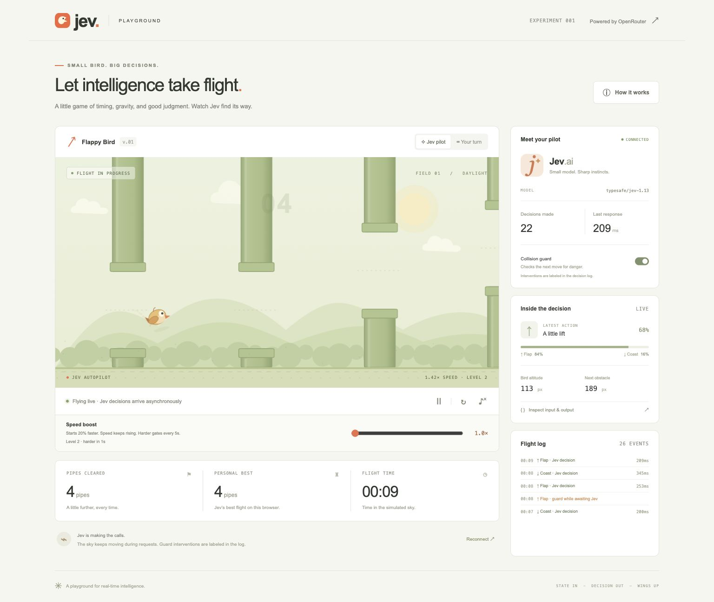
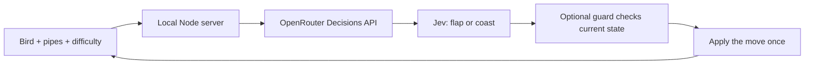

# 🐤 Jev Flight Lab

**One bird. Two decisions. No speed limit.**

Give an AI a pair of wings and a very simple job: stay alive.

Jev Flight Lab is a Flappy Bird playground where [TypeSafe’s Jev](https://openrouter.ai/typesafe/jev-1.13) receives structured game data through OpenRouter and chooses **flap** or **coast**. You can watch its decisions arrive, inspect what it saw, turn up the speed, or take the controls yourself.

The catch? The sky keeps accelerating. Every five seconds, the obstacles get meaner.



_An actual Jev flight through OpenRouter, with the optional collision guard enabled. The screenshot is a moment from a run, not a performance benchmark._

[Take off](#take-off) · [Try the challenge](#the-30-second-club) · [Under the wings](#under-the-wings) · [Tinker](#make-it-your-own)

## A small game with a lot to watch

- **An AI at the controls.** Real Jev decisions via OpenRouter’s Decisions API, with a live flight log.
- **A sky that never waits.** Continuous physics and animation while requests run in the background.
- **An increasingly unreasonable commute.** Uncapped acceleration, narrowing gaps, tighter pipe spacing, and bigger height changes.
- **A speed boost you can grab.** Drag the slider during flight to multiply the current speed by up to 2×.
- **A window into each decision.** Inspect the input, candidate trajectories, returned choice, probabilities when available, and the state when the move was applied.
- **A live JSON debug stream.** Expand **Live JSON** in the sidebar for formatted, syntax-highlighted provider replies, arrival times, and request timings. It automatically follows the newest response.
- **Your turn, too.** Keyboard and touch controls, optional sound, pause/resume, and local best scores.

**Zero dependencies. No build step. Just Node.js and a browser.**

## Take off

You’ll need **Node.js 22.13+** and an OpenRouter API key with access to Jev. Manual play needs no key.

From the repository directory, create your environment file if you don’t already have one:

```sh
test -f .env || cp .env.example .env
```

Add your key to `.env`:

```dotenv
OPENROUTER_API_KEY=your_openrouter_key_here
JEV_MODEL=typesafe/jev-1.13
PORT=3000
```

Start the game:

```sh
npm start
```

Open **[localhost:3000](http://localhost:3000)** and click **Start flight**. Or select **Your turn** to fly yourself.

The key stays on the server. `.env` is ignored by Git and never served to the browser. Restart the server after changing it. Jev flights use your OpenRouter credits; pausing stops new requests, and a completed flight shows reported API cost when available.

| Control                    | What it does                                              |
| -------------------------- | --------------------------------------------------------- |
| **Space** or tap the sky   | Flap in **Your turn** mode                                |
| **P** or the pause button  | Pause; press **P** or **Resume flight** to continue       |
| **↻**                      | Reset the flight                                          |
| **Speed boost** slider     | Apply a 1×–2× multiplier on top of automatic acceleration |
| **Collision guard** switch | Enable or disable assistance before starting a flight     |
| **Inspect input & output** | See the latest applied Jev decision and its context       |
| **Live JSON** switch       | Show incoming JSON with browser round-trip and provider timing |

Live JSON keeps the latest 30 responses across flight resets, including replies received while the panel is hidden. **Clear** empties the local log. Successful entries show the original provider JSON before the collision guard; failures are labeled API or browser errors. Refreshing the page clears the history.

Switching away from the tab pauses the game. Best scores are stored in your browser, separately for human, assisted Jev, and unassisted Jev flights.

## The 30-Second Club

**Can you survive longer than Jev? And how much does a safety net change the result?**

Set **Speed boost to 1.0×**, then try three flights in each mode. Reset between attempts and record your best time and pipe count.

| Round                          | Setup                                                          | Your mission                                                  |
| ------------------------------ | -------------------------------------------------------------- | ------------------------------------------------------------- |
| **1. Human reflexes**          | Select **Your turn**                                           | Find a rhythm. Establish the score Jev has to beat.           |
| **2. Jev, no training wheels** | Select **Jev pilot**, switch the guard **off** before starting | See how far Jev’s own choices get under real network latency. |
| **3. Jev + a safety net**      | Reset and switch the guard **on**                              | Aim for 30 seconds. Watch for the orange guard interventions. |

At 30 seconds you’re on **level 7**, moving at **1.92× the original base speed**, before any slider boost. The gaps have been getting tighter the whole time.

| Pilot          | Best flight time | Pipes cleared |
| -------------- | ---------------- | ------------- |
| You            |                  |               |
| Jev, guard off |                  |               |
| Jev, guard on  |                  |               |

**Bonus round: “Surely this is fine.”** Survive 15 seconds with the guard on, then drag the boost to **2.0×** without pausing. Try to reach level 7. The displayed speed includes both the ramp and your boost.

**Bonus experiment: predict the pilot.** Pause a Jev flight, open the inspector, and look at its input before reading the output. Would you flap or coast? Compare your intuition with the trajectory predictions and Jev’s choice. When the guard intervenes, compare the original input with `applicationState`—the bird may have moved while the response was traveling.

Courses are randomized, replies vary, and network latency matters. This is a hands-on experiment, not a controlled model benchmark. Compare several runs with the same boost setting. **A guard-assisted score measures the combined system, not Jev alone.**

## The sky gets less forgiving

The bird starts **20% faster** than the original game, at **138 pixels per second**. Forward speed keeps rising for as long as the flight lasts:

```text
speed = 138 × (1 + flightSeconds / 50) × sliderBoost
```

There is **no speed cap**. Every five active seconds, a new difficulty level changes the course:

| What changes                            | Progression                             |
| --------------------------------------- | --------------------------------------- |
| Pipe openings                           | 14 px narrower per level, down to 84 px |
| New pipe spacing                        | 12 px closer per level, down to 180 px  |
| Maximum height change between new pipes | 12 px larger per level, up to 160 px    |

Approaching gaps tighten smoothly and stop changing before the bird enters them. Spacing and height changes apply to newly generated pipes. Gravity and flap strength stay the same. The slider changes future movement without teleporting the scenery.

Pause freezes progression. Reset starts a fresh course and difficulty ramp while keeping your selected slider boost.

## Under the wings



The browser sends structured state to `POST /api/decision`. The server validates it and computes candidate trajectories using the same physics as the game. Jev receives positions, velocity, actual pipe openings, current speed and difficulty, and the predicted outcomes of both actions. It does not receive screenshots.

The server calls **`https://openrouter.ai/api/alpha/decisions`** with `{ model, state, questions }`. Jev returns a typed choice in `answers.movement.choice`, plus optional confidence and probabilities. This uses the **Decisions API**, not chat completions.

Physics uses a 120 Hz base step, with smaller steps when necessary to catch collisions at high speed. Rendering follows the display refresh rate. Requests have at most one call in flight and start no more often than every 180 ms. Each reply is consumed once at a control boundary. Without a fresh reply, the bird coasts, subject to the guard. The displayed response time is the full browser round trip—not a guaranteed decision interval.

### What the collision guard actually does

The local guard searches possible flap/coast sequences over **1.44 simulated seconds**. It checks Jev’s choice against the bird’s **current** position, which may differ from the position originally sent to the model.

If the proposed move has no safe continuation but the alternative does, the guard substitutes it. The log makes the source explicit:

- **Jev decision:** the model’s choice was applied.
- **Guard corrected Jev:** a local safety check changed that choice.
- **Guard while awaiting Jev:** a local intervention covered a delayed response.

Guard-only interventions never increment the Jev decision count. The inspector records the original input, state age, original choice, applied action, and any correction. Turning the guard off leaves the bird entirely dependent on Jev’s decisions and gravity between replies.

The guard has a finite lookahead, and the course eventually becomes extremely demanding. Crashes are part of the experiment. API failures pause the flight with an explanation; they do not silently switch to a fake AI pilot.

## Make it your own

| File                                   | What to explore                                                             |
| -------------------------------------- | --------------------------------------------------------------------------- |
| [`public/engine.js`](public/engine.js) | Gravity, speed ramp, difficulty levels, predictions, and the guard          |
| [`public/pilot.js`](public/pilot.js)   | The asynchronous decision mailbox and continuous control loop               |
| [`server/jev.js`](server/jev.js)       | Jev’s question, choice criteria, validation, and OpenRouter request         |
| [`public/app.js`](public/app.js)       | Canvas artwork, controls, telemetry, and sound                              |
| [`server/index.js`](server/index.js)   | Local HTTP server and server-only configuration                             |
| [`test/`](test/)                       | Physics, progression, delayed responses, API contracts, and security checks |

A useful next experiment: change only Jev’s choice criteria in `server/jev.js`, then repeat the three-flight unassisted challenge. Can better instructions improve the result without changing the physics or adding assistance?

```sh
npm run dev  # Restart on source changes; refresh the browser after UI changes.
npm test     # Built-in Node test runner. Mocked provider calls; no API spend.
```

Tests cover accelerating motion, progressively harder gates, collision detection, slider continuity, delayed replies, guard behavior, input validation, private-file isolation, and upstream errors.

## If the bird won’t take off

| Symptom                                           | Try this                                                                 |
| ------------------------------------------------- | ------------------------------------------------------------------------ |
| “One key away from takeoff”                       | Set `OPENROUTER_API_KEY` in `.env`, restart the server, then reconnect.  |
| Key rejected, insufficient credits, or rate limit | Check the displayed OpenRouter error, resolve it, then resume.           |
| Old controls or behavior after an update          | Refresh the browser. Restart the server if server code changed.          |
| “A decision is already pending”                   | Pause other AI flights; this local server permits one request at a time. |
| No API key yet                                    | Choose **Your turn**. The whole game works manually.                     |

The server binds to `127.0.0.1` for local use. Public hosting would need authentication and per-user spending/request controls before exposing the API route.

Built with vanilla JavaScript, Canvas 2D, and Node.js. Integration references: [Jev on OpenRouter](https://openrouter.ai/typesafe/jev-1.13) · [Decisions API](https://openrouter.ai/docs/api/api-reference/alphadecisions/submit-a-decisions-questions-and-answers-request).

**State in. Decision out. Wings up.**
